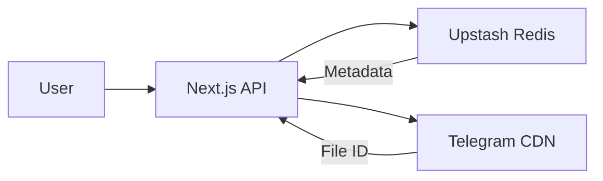

# ⚡ VoltEdge: Ultra-Fast Edge Media Hosting

[](https://nextjs.org/)
[](https://upstash.com/)
[](https://telegram.org/)
[](https://opensource.org/licenses/MIT)

**VoltEdge** is a professional-grade, open-source image hosting platform designed for speed and infinite scalability. It leverages the Telegram Bot API as a decentralized storage backend and Upstash Redis for high-performance metadata management, delivering Media directly through edge redirection.

---

## 🚀 Key Features

*   **📦 Messaging-Backbone Storage**: Unlimited, free, and decentralized storage powered by Telegram infrastructure.
*   **🏎️ Edge Content Delivery**: Uses high-speed redirection (302) to minimize server bandwidth and maximize delivery speed.
*   **🛠️ Developer-First API**: Fully versioned REST API (`/api/v1`) for programmatic uploads and metadata retrieval.
*   **💎 Premium UX/UI**: A stunning, glassmorphic dark-mode interface built with Framer Motion and Outfit typography.
*   **🔗 Custom Vanity URLs**: Support for custom file names and human-readable slugs.
*   **📊 Real-time Analytics**: Built-in view counters and metadata tracking (size, format, timestamp).
*   **📱 QR Integration**: Instant QR code generation for every uploaded asset.

---

## 🛠️ Tech Stack

- **Framework**: [Next.js 15+](https://nextjs.org/) (App Router)
- **Database**: [Upstash Redis](https://upstash.com/)
- **Storage**: [Telegram Bot API](https://core.telegram.org/bots/api)
- **Styling**: [Vanilla CSS](https://developer.mozilla.org/en-US/docs/Web/CSS) + [Framer Motion](https://www.framer.com/motion/)
- **API**: Versioned REST JSON API

---

## 🔌 Developer API

VoltEdge is built with a developer-first approach. You can programmatically upload images and retrieve metadata using our versioned REST API.

### API v2 (Recommended) - With Authentication

API v2 introduces authentication, API keys, higher rate limits, and webhooks. Authentication is optional but recommended for production use.

#### Authentication

**Register a new account:**
```bash
POST /api/v2/auth/register
Content-Type: application/json

{
  "email": "user@example.com",
  "password": "secure-password"
}
```

**Login:**
```bash
POST /api/v2/auth/login
Content-Type: application/json

{
  "email": "user@example.com",
  "password": "secure-password"
}
```

**Get current user:**
```bash
GET /api/v2/auth/me
Authorization: Bearer <token>
# Or use the auth_token cookie set during login
```

#### API Keys

Create API keys from the [Dashboard](/dashboard) or via API:

**Create API Key:**
```bash
POST /api/v2/keys
Authorization: Bearer <token>
Content-Type: application/json

{
  "name": "Production Key",
  "rate_limit": 100
}
```

**List API Keys:**
```bash
GET /api/v2/keys
Authorization: Bearer <token>
```

**Use API Key:**
```bash
POST /api/v2/upload
X-API-Key: px_your_api_key_here
Content-Type: multipart/form-data
```

#### Upload with API v2

**Endpoint:** `POST /api/v2/upload`  
**Content-Type:** `multipart/form-data`  
**Authentication:** Optional (API key or JWT token)

| Parameter | Type | Required | Description |
| :--- | :--- | :--- | :--- |
| `file` | File | Yes | The image file to upload. |
| `customId` | String | No | Custom vanity slug for the link. |

**Rate Limits:**
- Anonymous: 20 requests/minute
- Authenticated (JWT): 50 requests/minute
- API Key: Custom (default: 100 requests/minute)

**Example Request (cURL with API Key):**
```bash
curl -X POST https://your-voltedge.com/api/v2/upload \
  -H "X-API-Key: px_your_api_key_here" \
  -F "file=@/path/to/image.jpg" \
  -F "customId=my-awesome-link"
```

**Example Request (cURL with JWT):**
```bash
curl -X POST https://your-voltedge.com/api/v2/upload \
  -H "Authorization: Bearer <your-jwt-token>" \
  -F "file=@/path/to/image.jpg"
```

#### Webhooks

Configure webhooks to receive notifications when images are uploaded or deleted:

**Create Webhook:**
```bash
POST /api/v2/webhooks
Authorization: Bearer <token>
Content-Type: application/json

{
  "url": "https://your-server.com/webhook",
  "events": ["upload", "delete"]
}
```

**Webhook Payload:**
```json
{
  "event": "upload",
  "timestamp": 1705500000000,
  "data": {
    "id": "image-id",
    "url": "https://voltedge.link/i/image-id",
    "size": 102400,
    "type": "image/jpeg",
    "created_at": 1705500000000
  }
}
```

---

### API v1 (Legacy)

The v1 API remains available for backward compatibility.

#### 1. Upload Media
**Endpoint:** `POST /api/v1/upload`  
**Content-Type:** `multipart/form-data`

| Parameter | Type | Required | Description |
| :--- | :--- | :--- | :--- |
| `file` | File | Yes | The image file to upload. |
| `customId` | String | No | Custom vanity slug for the link. |

**Example Request (cURL):**
```bash
curl -X POST https://your-voltedge.com/api/v1/upload \
  -F "file=@/path/to/image.jpg" \
  -F "customId=my-awesome-link"
```

#### 2. Get Image Metadata
**Endpoint:** `GET /api/v1/info/[id]`

**Example Response:**
```json
{
  "success": true,
  "data": {
    "id": "my-awesome-link",
    "url": "https://voltedge.link/i/my-awesome-link",
    "views": 42,
    "created_at": 1705500000000,
    "metadata": {
      "size": 102400,
      "type": "image/jpeg"
    }
  }
}
```

---

## 🤝 Open Source & Contributions

VoltEdge is **Open Source** and built for the community! We are actively looking for collaborators and contributors to make this the ultimate image hosting solution.

### How to Collaborate:
1.  **Fork** the repository and experiment with new features.
2.  **Open an Issue** if you find bugs or have feature requests.
3.  **Submit Pull Requests** for UI improvements, API enhancements, or documentation.
4.  **Join the Discussion**: Help us shape the future of edge-based messaging storage.

---

## ⚙️ Getting Started

### 1. Prerequisites
- A **Telegram Bot Token** (From [@BotFather](https://t.me/botfather))
- A **Telegram Chat ID** (Use [@userinfobot](https://t.me/userinfobot))
- An **Upstash Redis** account (Free tier is perfect)

### 2. Environment Variables
Create a `.env.local` file:
```env
TELEGRAM_BOT_TOKEN=your_token
TELEGRAM_CHAT_ID=your_id
UPSTASH_REDIS_REST_URL=your_url
UPSTASH_REDIS_REST_TOKEN=your_token
NEXT_PUBLIC_BASE_URL=https://your-deployment.com
JWT_SECRET=your-secret-key-change-in-production

# Optional: Hugging Face Hub Storage (alternative to Telegram)
HF_TOKEN=your_hf_token
HF_REPO_ID=username/repo-name
HF_REPO_TYPE=dataset
USE_HF_STORAGE=false
```

**Note:** 
- `JWT_SECRET` is required for API v2 authentication. Use a strong, random secret in production.
- **Storage Backend**: By default, VoltEdge uses Telegram for storage. You can optionally use Hugging Face Hub by setting `USE_HF_STORAGE=true` and providing HF credentials. See `HUGGINGFACE_SETUP.md` for details.
- **⚠️ Important**: Hugging Face Hub still goes through Vercel, so it won't bypass Vercel's 4.5MB/50MB upload limits. For true 2GB uploads, you need direct client uploads (S3, R2, etc.).

### 3. One-Click Deploy
[](https://vercel.com/new/clone?repository-url=https%3A%2F%2Fgithub.com%2Ftaslim19%2FCoreEdge&env=TELEGRAM_BOT_TOKEN,TELEGRAM_CHAT_ID,UPSTASH_REDIS_REST_URL,UPSTASH_REDIS_REST_TOKEN,NEXT_PUBLIC_BASE_URL)

---

## 🤖 Telegram Bot Integration

VoltEdge includes a built-in Telegram Bot for direct uploads from your messaging app.

### Setting up the Webhook
Once you deploy VoltEdge to Vercel (or any public URL), you must link your bot to the webhook endpoint. Visit the following URL in your browser:

`https://api.telegram.org/bot<YOUR_BOT_TOKEN>/setWebhook?url=https://your-domain.com/api/webhook/telegram`

### Bot Commands
- `/start` : Show the welcome message.
- `/upload` or `/tgm` : Upload an image.
- `/help` : Shows the instructions.


### Features
- **Direct Upload**: Send any Media or File (as image/video) to the bot for an instant link.
- **Reply to Upload**: Reply to any existing image in a chat with `/upload` or `/tgm` to host it on VoltEdge.
- **DB Tracking**: Every upload is forwarded to your storage channel with a caption identifying the user (Name + ID or @Username).

---

## 📖 Project Structure & Architecture



---

`telegram-storage` `image-hosting` `cdn` `edge-computing` `telegraph` `upstash` `nextjs` `redis-database` `open-source` `serverless` `fast-upload` `decentralized-storage` `developer-api`

---

## 🌐 Community & Support

Stay updated with the latest features and get support for VoltEdge:

- 📢 **Updates**: [@Hunter_Update](https://t.me/Hunter_Update)
- 💬 **Support Group**: [@Hunter_Supports](https://t.me/Hunter_Supports)

---

## 📜 License
Distributed under the **MIT License**. Feel free to use, modify, and distribute as you wish!

---

**Forked from [GeekLuffy/PixEdge](https://github.com/GeekLuffy/PixEdge)**  
**Contributions by [taslim19](https://github.com/taslim19)**
